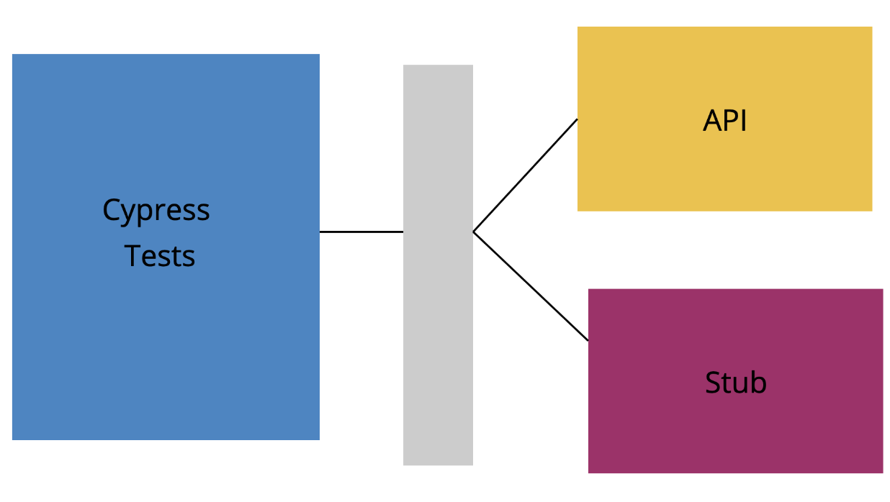

# Cypress Best Practices

## <a id="selectors"></a>Selectors

### Stopping multiple matches

- As a general rule your selector should not assume there is only one matching element on the page, e.g. clicking the first button on a page will break when another ticket adds another button.

#### Cypress proposes the following:

| Selector                             | Recommended | Notes                                                           |
| ------------------------------------ | ----------- | --------------------------------------------------------------- |
| `cy.get('button').click()`           | Never       | Worst - too generic, no context.                                |
| `cy.get('.btn.btn-large').click()`   | Never       | Bad. Coupled to styling. Highly subject to change.              |
| `cy.get('#main').click()`            | Sparingly   | Better. But still coupled to styling or JS event listeners.     |
| `cy.contains('Submit').click()`      | Depends     | Much better. But still coupled to text content that may change. |
| `cy.get('[data-cy=submit]').click()` | Always      | Best. Insulated from all changes.                               |

#### But, taking the view that "users don't click classes, IDs or class attributes", then the order of the last two rows becomes:

| Selector                             | Recommended | Notes                                                           |
| ------------------------------------ | ----------- | --------------------------------------------------------------- |
| `cy.get('button').click()`           | Never       | Worst - too generic, no context.                                |
| `cy.get('.btn.btn-large').click()`   | Never       | Bad. Coupled to styling. Highly subject to change.              |
| `cy.get('#main').click()`            | Sparingly   | Better. But still coupled to styling or JS event listeners.     |
| `cy.get('[data-cy=submit]').click()` | Depends     | Better, will be unlikely to break with style or wording change. |
| `cy.contains('Submit').click()`      | Always      | Best as user focused.                                           |

## <a id="fixtures"></a>Fixtures

### <a id="fixtures:xhr"></a>Block XHR calls

In order to make sure that all of your calls are mocked when you run your tests, you can prevent Cypress from making XHR calls to your backend.

In your `cypress.json`, you can setup a `blacklistHosts` property, which enables you to blacklist any host you want from XHR calls. It can be a string, or an array of strings if there are several hosts you want to blacklist. It also allows the use of wildcard \* patterns.

For example on The Best Project, we kept all the XHR calls to our backend from being made by adding this line to the `cypress.json`:

```
"blacklistHosts": "*.thebestproject.com",
```

More information on this [here](https://docs.cypress.io/guides/references/configuration.html#blacklistHosts)

### Intercept Delay on Fixtures

Even when network requests are stubbed out using fixtures, there is still a delay between API request and response.



You should explicitly wait on **all** network requersts that you stub, and taking [the point above](#fixtures:xhr) - **all** network requests should be stubbed.

```js
cy.server();
cy.route('users/*', 'fixture:users').as('getUsers');
cy.route('lightsabers/*', 'fixture:lightsabers').as('getLightsabers');

// page reauires routes via HOCs
cy.visit('http://localhost:3333/users');

// wait on routes via aliases
cy.wait(['@getLightsabers', '@getUsers']);

// will only run after network requests
cy.get('h1').should('contain', 'Users');

cy.get('li').should('contain', 'Luke');
```

Further to this, it is important not to simply allow any network request that roughly matches the regext to get the required data and continue. If your request is missing a key parameter, it does not make sense for your test to pass. Cypress allows assertions to be made on the promise returned from a fixture mock.

```js
cy.server();
cy.route('search/*', [{ item: 'Luke' }, { item: 'Yoda' }]).as('getSearch');

cy.contains('placeholder text').type('Good');

// after the wait we can still make an assertion
cy.wait('@getSearch')
  .its('url')
  .should('include', '/search?query=Good');
```


# <a id="reports"></a>Reports

As cypress uses Mocha, [mochawesome](https://github.com/adamgruber/mochawesome) can be used to build an easy to read HTML and CSS report.

Alternatively, a paid feature of cypress is the Cypress Dashboard which is very useful when the test running is distributed across several machines. 

# <a id="parallelization"></a>Parallelization


If your test runs are stating to slow your CI consider taking a payment plan for cypress as this will make Parallelization easy: https://docs.cypress.io/guides/guides/parallelization.html#Overview

# <a id="bdd"></a>BDD (Behaviour Driven Development)


## Cucumber 

`Behaviour driven development` (BDD), often referred to as the "Given, When, Then" approach, has been shown to be effective on some projects.
Cypress allows a fast feedback loop that allows the granularity of scenarios to be very fine.

-   A good introduction to BDD can be found in [this article](https://dannorth.net/whats-in-a-story/) by Dan North.
-  [Cucumber](https://cucumber.io/), a DSL (Domain Specific Language), can be used to write our scenarios.


We have experimented with this approach on a ticket by ticket basis, where the size of a ticket is < 1 dev day, but this approach although effective at preventing bugs does not scale well in terms of scenario duplication or test run time on CI. Interestingly the instance of False Positives, tests failing when nothing is broken was still low even with this high coverage.

Our current experiment now, within the teams using Cypress-BDD, is to highlight feature chains at a sprint level at the sprint planning and write scenarios for these with the business. The Sprint Goal is the main candidate for this, but other feature chains require coverage too.

## Cypress Cucumber Preprocessor

Cypress can run the scenarios through the [Cucumber Cypress plugin](https://github.com/TheBrainFamily/cypress-cucumber-preprocessor).

```js
import { Then } from "cypress-cucumber-preprocessor/steps";

Then(`I see {string} in the header`, header => {
  cy.get("h1").should("include", header);
});
```

## Writing Scenarios

-   Add a new file in `cypress/integration` with the extension `.feature`
    -  As a convention add the ticket number from Trello/JIRA to the start of the scenario, e.g. `Scenario: #34 - Adding items to basket` can help with traceability of features.
    -  The Feature name includes the full `GIVEN THEN WHEN`. This is to make the test reports readable and in domain terms.

```
Feature: GIVEN I'm on the Homepage THEN I see "Welcome to the website" in the title.

  Scenario: #81 Homepage title
    Given I'm on the Homepage
    Then I see "Welcome to the website" in the header
``` 

## Fixtures in BDD

The best practice is to apply fixtures on a feature by feature basis. It's not best practice to apply them all globally as it reduces readability of your test runs and can make debugging harder as some fixtures will need to override others.

Applying them as part of the scenario, or background, makes the tests slightly less readable to the business, but increases clarity for the development team as a whole.

```
  Background: I am on /user/list
      Given I have an API with users
      And I am on "/user/list"
      And I wait for "getUsers"
```

The corresponding step definitions can be centralised under a common api.js file with step defs such as:

```js
Given("I have an API with users", () => {
  cy.server()
  cy.fixture("users.json").as("users")
  cy.route("**/user/list", "@users").as("getUsers")
})
```

Waiting for fixtures is extremely important as it ensures assertions on your API calls and reduces test Flakyness, [see the point above](#fixtures:xhr). A generic step definition for waiting on aliases makes this quick to apply.

```
Given("I wait for {string}", alias => {
  cy.wait(`@${alias}`)
})
```
